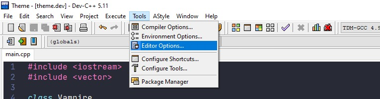
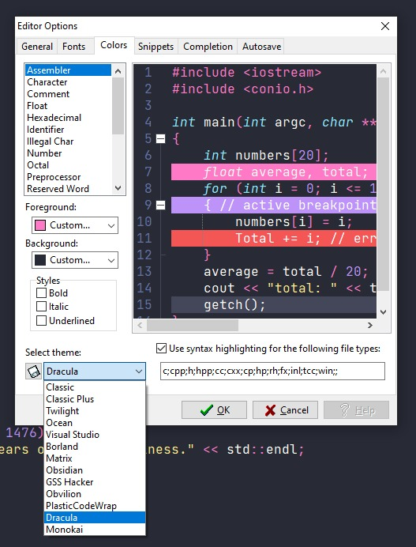

### [Dev C++](https://www.bloodshed.net/)

#### Installation

You can install it by cloning [this](https://github.com/Nxrth-x/dracula-dev-cpp) repository or from just downloading the [Dracula.syntax](https://github.com/Nxrth-x/dracula-dev-cpp/tree/master/Dracula.syntax) file.

#### Activating theme

To install this theme for the Windows version of [Dev C++](https://www.bloodshed.net/) all you have to do is:

Download the [Dracula.syntax](https://github.com/Nxrth-x/dracula-dev-cpp/tree/master/Dracula.syntax) file

Copy the file to `C:\Users\$YOUR_USERNAME\AppData\Roaming\Dev-Cpp`

Open the Dev C++ IDE

Go to `Tools > Editor Options` on the top menu

Open the `colors` tab and select `Dracula` as your theme

> That's it, now you're a vampire too! 🦇
