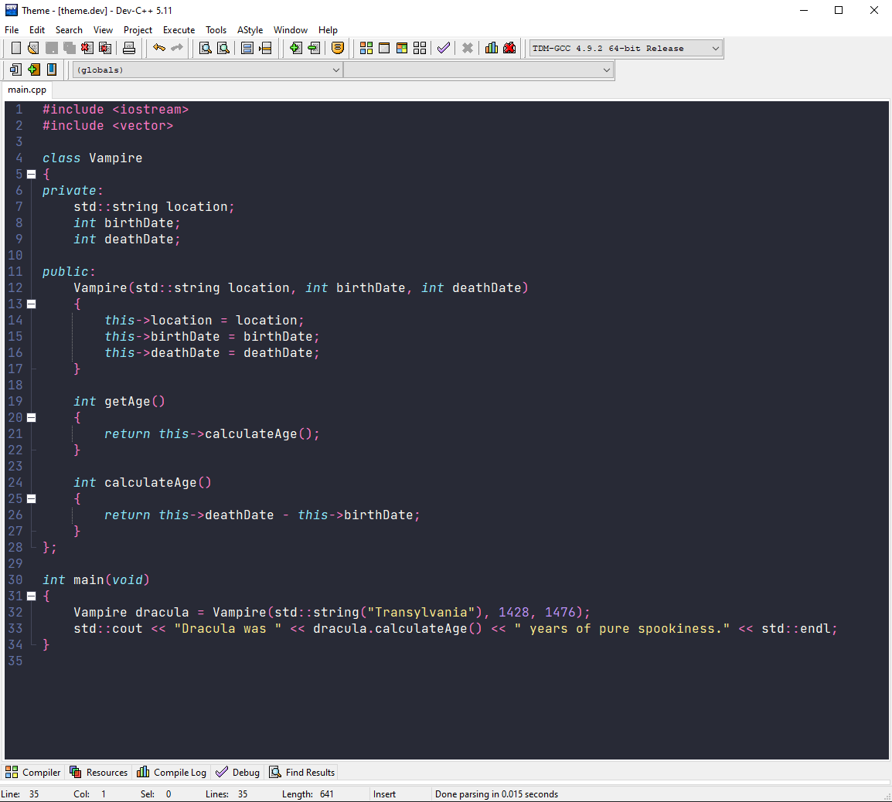

# Dracula for [Dev C++](https://www.bloodshed.net/)

> A dark theme for [Dev C++](https://www.bloodshed.net/).

## Install

All instructions can be found at [draculatheme.com/dev-cpp](https://draculatheme.com/dev-cpp).

## Team

This theme is maintained by the following person(s) and a bunch of [awesome contributors](https://github.com/Nxrth-x/dracula-dev-cpp/graphs/contributors).

|  |
| ----------------------------------------------------------------------------------- |
| [Nxrth-x](https://github.com/Nxrth-x)                                               |

## License

[MIT License](./LICENSE)
